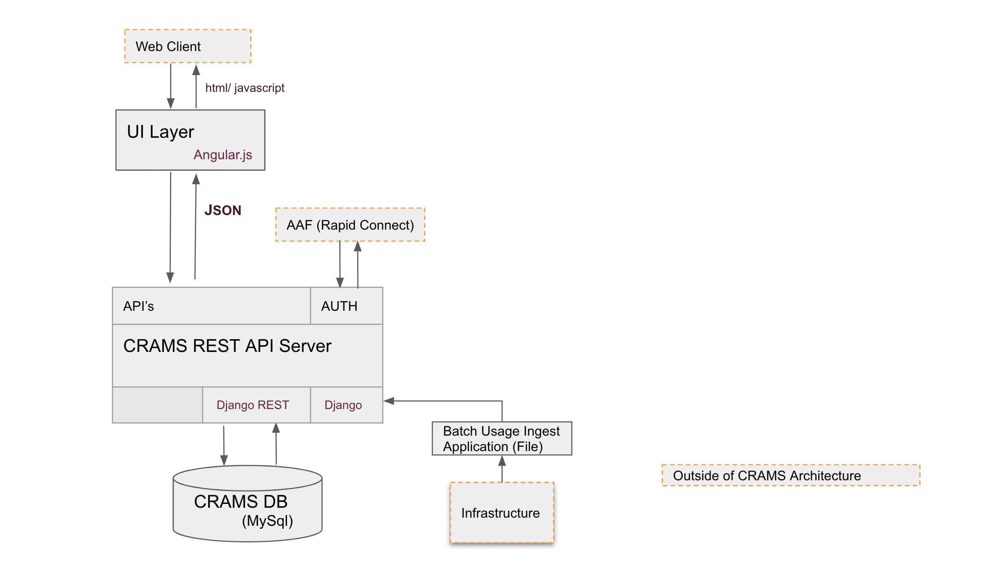

.. _architecture:

============
Architecture
============

This page describes the architecture of CRAMS.

Component Architecture
----------------------

    Fig. 1. CRAMS Technical Architecture
    
    

Web Server
  CRAMS is typically deployed with the standard
  `Nginx <http://nginx.org>`_ +
  `Gunicorn <http://gunicorn.org>`_ +
  `Django <http://www.djangoproject.com/>`_ +
  `Python <http://docs.python.org/>`_ stack.

RDBMS
  Ideally, use MySQL.

Functional Architecture
-----------------------

Scalability Model
-----------------

    

Security Model
--------------

Authentication
^^^^^^^^^^^^^^

Authorisation
^^^^^^^^^^^^^

Source Code
-----------

